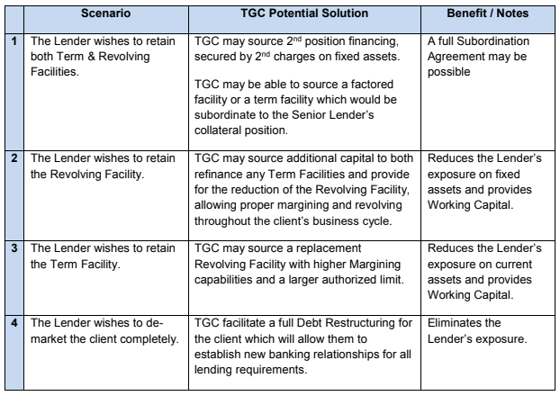

---
# Feel free to add content and custom Front Matter to this file.
# To modify the layout, see https://jekyllrb.com/docs/themes/#overriding-theme-defaults

layout: "default"
description: "Working With Special Accounts"
author: "Ezra Fast"
url: "./special-accounts"
---

  <h3><strong>Special Account Services</strong></h3>

    <h4>Special Account Services We Offer:</h4>

    

        TGC Capital Inc. (TGC) works directly with senior and secondary lenders to help the borrower return to a
        performing account status. TGC recognizes that Special Accounts Officers have a mandate to work with
        clients as long as possible, to rectify situations which could impact the borrower’s ability to continue as a
        Going Concern and to ensure quick payout of clients which are no longer a fit for the Bank.
    

    

        Clients assigned to a Special Accounts status have often experienced an industry wide down turn which
        has resulted in substantially lower revenue and profitability. As the industry recovers, rebounding sales
        put additional stress on the company which does not have the historic earnings or margining capability to
        finance the working capital needed to increase sales.
    

    <h4>Four distinct situations in which TGC may be able to assist:</h4>
    

    

        TGC personnel have participated in hundreds of transactions with over $2 Billion in placements covering
        all industries, company sizes and all stages of the growth cycle.
    

    

        With a network of over 100 lenders and investors, TGC has access to the specialized capital sources
        companies need.
    

